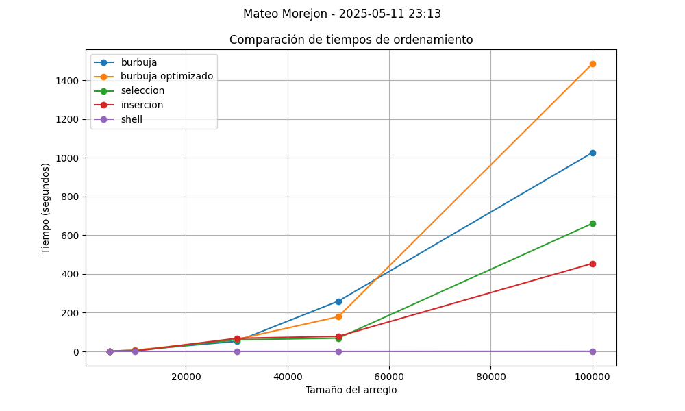

# **Práctica 4.2 - Algoritmos de Ordenamiento**
**Nombre:** Mateo Morejón, Sebastian Ceron 
**Materia:** Estructura de Datos  
**Carrera:** Computación  
**Fecha:** 11/05/25  

---

## **Objetivos**

- Comparar el rendimiento de los algoritmos de ordenamiento: burbuja, burbuja optimizado, selección, inserción y shell.
- Medir el tiempo de ejecución de cada algoritmo con diferentes tamaños de entrada.
- Analizar la complejidad algorítmica a través de pruebas experimentales.

---

##  **Tamaños utilizados**

Los tamaños de los arreglos aleatorios fueron:
- 5.000
- 10.000
- 30.000
- 50.000
- 100.000

---

##  **Metodología**

- Se generó un único arreglo aleatorio de tamaño 100.000.
- Para cada tamaño `n`, se usaron los primeros `n` elementos del arreglo base.
- Cada algoritmo ordenó una copia del mismo arreglo para evitar alteraciones del original.
- Se utilizó `time.perf_counter()` para medir los tiempos de ejecución en segundos.

---

##  **Resultados**

### Tabla de resultados

| Tamaño | Burbuja     | Burbuja Optim. | Selección   | Inserción   | Shell     |
| ------ | ----------- | -------------- | ----------- | ----------- | --------- |
| 5000   | 1.046782s   | 1.607953s      | 0.574279s   | 0.796420s   | 0.015298s |
| 10000  | 3.845265s   | 6.303523s      | 2.228908s   | 3.028643s   | 0.035698s |
| 30000  | 47.572080s  | 80.171621s     | 34.076854s  | 37.462481s  | 0.183952s |
| 50000  | 157.570469s | 245.823446s    | 88.897561s  | 109.095010s | 0.350902s |
| 100000 | 506.772817s | 832.801040s    | 206.472586s | 387.114377s | 0.494813s |

---

###  Gráfica comparativa

---

## **Conclusiones**

- Los algoritmos burbuja, burbuja optimizado, selección e inserció tienen una complejidad O(n²), lo cual hace que se vuelvan ineficientes con     arreglos grandes. El algoritmo shell sort mostró un rendimiento superior debido a su complejidad promedio más baja (O(n log n)).
 
-A mayor tamaño de entrada, se vuelve más clara la diferencia de eficiencia entre los métodos.
 Para aplicaciones reales con grandes volúmenes de datos, se deben preferir algoritmos más eficientes como Shell, Merge o Quick Sort.

---

## **Repositorio**

[Enlace al repositorio en GitHub](https://github.com/matexss/icc-est-u1-PracticaComplejidad)

##  Recomendaciones

- Asegurar que cada algoritmo reciba una copia del arreglo sin haber sido previamente ordenado.
- No generar un arreglo nuevo por cada método: el mismo arreglo base debe ser usado.
- Usar funciones de tiempo apropiadas (`perf_counter`) para una medición más precisa.

---

**Docente:** Ing. Pablo Torres  
